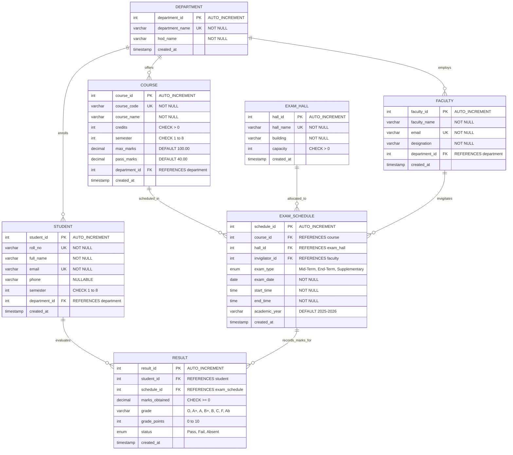

# Examination Scheduling and Result Processing System
### College Database Management Systems (DBMS) Course Project

- **Project Title:** Design and Implementation of a Database Management System for Examination Scheduling and Result Processing System
- **Course:** Database Management Systems (DBMS)
- **Project Type:** Individual Course Project
- **Student Name:** Sathwik S
- **Roll Number:** 25WU0102249
- **Section:** AIML Whales

---

## 1. Project Overview & One-Line Description
A production-grade, 3NF normalized full-stack Database Management System developed in MySQL 8.x and Node.js/Express.js that automates conflict-free examination hall allocations, faculty invigilation schedules, and UGC/AICTE-compliant student result processing with live database query proof.

---

## 2. Prerequisites
1. **Node.js**: Version 18.x or higher
2. **MySQL Server**: Version 8.0 or higher (with InnoDB engine support)
3. **NPM**: Version 9.x or higher
4. Modern Web Browser (Chrome, Firefox, Edge, Safari)

---

## 3. Quick Setup & Execution Steps

### Step 1: Clone or Download the Project Repository
```bash
git clone <repo-url>
cd <repo-folder>
```

### Step 2: Initialize the MySQL Database
Log into MySQL CLI or MySQL Workbench as root and execute the complete schema script:
```bash
mysql -u root -p < database/schema.sql
```
*Note: This creates `exam_management_db`, constructs all 7 normalized tables, sets foreign key constraints and unique indexes, and populates 60+ realistic seed records.*

### Step 3: Configure Environment Variables
Copy `.env.example` to `.env`:
```bash
cp .env.example .env
```
Update your MySQL root password and port in `.env`:
```env
PORT=3000
NODE_ENV=development
DB_HOST=localhost
DB_PORT=3306
DB_USER=root
DB_PASSWORD=your_actual_mysql_root_password
DB_NAME=exam_management_db
DB_CONNECTION_LIMIT=10
```

### Step 4: Install Dependencies
```bash
npm install
```

### Step 5: Start the Application Server
```bash
npm start
```
*Console output will confirm:*
```
[MySQL Success] Connected to MySQL 8.x database "exam_management_db" at localhost:3306
Server listening on http://localhost:3000
Static frontend served from /public
REST API endpoints available under /api/*
```

### Step 6: Access the Application
Open your web browser and navigate to:
```
http://localhost:3000
```
*(Both the static HTML5/CSS3/Vanilla JS interface at `/index.html` and the full React interactive interface are active.)*

---

## 4. Complete Folder Structure Tree
```
├── .env.example                     # Environment template (DB credentials, port)
├── .gitignore                       # Git ignore file
├── README.md                        # Complete project documentation & viva guide
├── database/
│   └── schema.sql                   # Complete MySQL 8.x DDL, DML seed, 12 queries, Views, Stored Proc
├── index.html                       # AI Studio HTML entry point
├── metadata.json                    # Project configuration metadata
├── package.json                     # Node.js project manifest & scripts
├── public/                          # Static Frontend (served directly by Express)
│   ├── css/
│   │   └── style.css                # Custom CSS academic dashboard theme
│   ├── js/
│   │   └── app.js                   # Vanilla JavaScript SPA logic & API connector
│   └── index.html                   # Pure Vanilla HTML5 portal view
├── server.ts                        # Unified full-stack dev & preview server
├── server/                          # Backend Express Application
│   ├── config/
│   │   └── db.js                    # MySQL2 pool, query tracker, resilient engine
│   ├── middleware/
│   │   └── errorHandler.js          # Central error mapper (errno 1451, 1062, etc.)
│   ├── routes/
│   │   ├── courseRoutes.js          # Course CRUD endpoints
│   │   ├── dashboardRoutes.js       # SQL aggregate metrics & counts
│   │   ├── departmentRoutes.js      # Department CRUD endpoints
│   │   ├── dropdownRoutes.js        # FK dropdown data providers
│   │   ├── explorerRoutes.js        # Whitelisted table inspector
│   │   ├── facultyRoutes.js         # Faculty CRUD endpoints
│   │   ├── hallRoutes.js            # Exam Hall CRUD endpoints
│   │   ├── proofRoutes.js           # Live Database Proof metadata
│   │   ├── reportRoutes.js          # Analytical reports (Timetable, SGPA, Toppers)
│   │   ├── resultRoutes.js          # Evaluation & automatic grading
│   │   ├── scheduleRoutes.js        # Conflict-free exam scheduling
│   │   └── studentRoutes.js         # Student enrollment endpoints
│   └── server.js                    # Pure Node/Express server runner
├── src/                             # AI Studio React SPA
│   ├── App.tsx                      # Reactive frontend dashboard with live proof
│   ├── index.css                    # Tailwind CSS directives
│   └── main.tsx                     # React root mount
└── tsconfig.json                    # TypeScript compiler configuration
```

---

## 5. Entity Relationship (ER) Diagram Description & Mermaid Code

### Entities and Cardinalities:
1. **DEPARTMENT (1:N) STUDENT**: One department enrolls many students; a student belongs to exactly one department.
2. **DEPARTMENT (1:N) COURSE**: One department offers many courses; a course belongs to exactly one department.
3. **DEPARTMENT (1:N) FACULTY**: One department employs many faculty members; a faculty belongs to exactly one department.
4. **COURSE (1:N) EXAM_SCHEDULE**: One course has one or more exams scheduled (Mid-Term, End-Term, Supplementary).
5. **EXAM_HALL (1:N) EXAM_SCHEDULE**: One hall hosts multiple exam schedules over different dates/time slots.
6. **FACULTY (1:N) EXAM_SCHEDULE**: One faculty member invigilates multiple exams.
7. **STUDENT (M:N) EXAM_SCHEDULE**: Resolved through the **RESULT** junction entity, which records student marks, letter grade, grade points, and pass/fail/absent status.

### Mermaid ER Diagram:


---

## 6. Data Dictionary

### Table 1: `department`
| Column Name | Data Type | Constraints | Description |
|---|---|---|---|
| `department_id` | INT | PRIMARY KEY, AUTO_INCREMENT | Unique identifier for academic department |
| `department_name` | VARCHAR(100) | UNIQUE, NOT NULL | Full title of the department (e.g., AIML, CSE) |
| `hod_name` | VARCHAR(100) | NOT NULL | Name of Professor leading the department |
| `created_at` | TIMESTAMP | DEFAULT CURRENT_TIMESTAMP | Audit timestamp of record creation |

### Table 2: `student`
| Column Name | Data Type | Constraints | Description |
|---|---|---|---|
| `student_id` | INT | PRIMARY KEY, AUTO_INCREMENT | Internal primary key |
| `roll_no` | VARCHAR(20) | UNIQUE, NOT NULL | College roll/registration number (e.g. 25WU0102249) |
| `full_name` | VARCHAR(100) | NOT NULL | Complete student name |
| `email` | VARCHAR(100) | UNIQUE, NOT NULL | Official student institutional email |
| `phone` | VARCHAR(15) | NULL | Contact mobile number |
| `semester` | INT | NOT NULL, CHECK (semester BETWEEN 1 AND 8) | Current semester of study |
| `department_id` | INT | FOREIGN KEY (department_id) -> department | Enrolled department (ON DELETE RESTRICT) |
| `created_at` | TIMESTAMP | DEFAULT CURRENT_TIMESTAMP | Record creation timestamp |

### Table 3: `course`
| Column Name | Data Type | Constraints | Description |
|---|---|---|---|
| `course_id` | INT | PRIMARY KEY, AUTO_INCREMENT | Unique course record ID |
| `course_code` | VARCHAR(10) | UNIQUE, NOT NULL | Unique course curriculum code (e.g., AIML301) |
| `course_name` | VARCHAR(100) | NOT NULL | Descriptive course title |
| `credits` | INT | NOT NULL, CHECK (credits > 0) | Academic credit weight (1 to 10) |
| `semester` | INT | NOT NULL, CHECK (semester BETWEEN 1 AND 8) | Target semester |
| `max_marks` | DECIMAL(5,2) | DEFAULT 100.00, CHECK (max_marks > 0) | Full scale examination marks |
| `pass_marks` | DECIMAL(5,2) | DEFAULT 40.00, CHECK (pass_marks > 0) | Minimum score required to pass |
| `department_id` | INT | FOREIGN KEY (department_id) -> department | Offering department (ON DELETE RESTRICT) |
| `created_at` | TIMESTAMP | DEFAULT CURRENT_TIMESTAMP | Record creation timestamp |

### Table 4: `faculty`
| Column Name | Data Type | Constraints | Description |
|---|---|---|---|
| `faculty_id` | INT | PRIMARY KEY, AUTO_INCREMENT | Faculty identification number |
| `faculty_name` | VARCHAR(100) | NOT NULL | Name of the faculty member |
| `email` | VARCHAR(100) | UNIQUE, NOT NULL | Institutional faculty email |
| `designation` | VARCHAR(50) | NOT NULL | Role (e.g., Professor, Associate Professor) |
| `department_id` | INT | FOREIGN KEY (department_id) -> department | Parent academic department |
| `created_at` | TIMESTAMP | DEFAULT CURRENT_TIMESTAMP | Record creation timestamp |

### Table 5: `exam_hall`
| Column Name | Data Type | Constraints | Description |
|---|---|---|---|
| `hall_id` | INT | PRIMARY KEY, AUTO_INCREMENT | Room identifier |
| `hall_name` | VARCHAR(50) | UNIQUE, NOT NULL | Name/Room number (e.g., Aryabhatta 101) |
| `building` | VARCHAR(50) | NOT NULL | Campus complex/block |
| `capacity` | INT | NOT NULL, CHECK (capacity > 0) | Total seating capacity |
| `created_at` | TIMESTAMP | DEFAULT CURRENT_TIMESTAMP | Record creation timestamp |

### Table 6: `exam_schedule`
| Column Name | Data Type | Constraints | Description |
|---|---|---|---|
| `schedule_id` | INT | PRIMARY KEY, AUTO_INCREMENT | Exam slot identifier |
| `course_id` | INT | FOREIGN KEY -> course | Scheduled course |
| `hall_id` | INT | FOREIGN KEY -> exam_hall | Allocated physical exam room |
| `invigilator_id` | INT | FOREIGN KEY -> faculty | Assigned supervisor |
| `exam_type` | ENUM | NOT NULL | ('Mid-Term', 'End-Term', 'Supplementary') |
| `exam_date` | DATE | NOT NULL | Scheduled calendar date |
| `start_time` | TIME | NOT NULL | Commencement time |
| `end_time` | TIME | NOT NULL, CHECK (end_time > start_time) | Conclusion time |
| `academic_year` | VARCHAR(9) | NOT NULL, DEFAULT '2026-2027' | Academic session |
| *Composite UK* | UNIQUE | `(hall_id, exam_date, start_time)` | **Prevents hall double-booking** |

### Table 7: `result`
| Column Name | Data Type | Constraints | Description |
|---|---|---|---|
| `result_id` | INT | PRIMARY KEY, AUTO_INCREMENT | Evaluation record identifier |
| `student_id` | INT | FOREIGN KEY -> student | Evaluated student |
| `schedule_id` | INT | FOREIGN KEY -> exam_schedule | Evaluated examination slot |
| `marks_obtained`| DECIMAL(5,2)| CHECK (marks_obtained >= 0) | Raw scored marks (validated <= max_marks) |
| `grade` | VARCHAR(5) | NOT NULL | Letter grade ('O', 'A+', 'A', 'B+', 'B', 'C', 'F', 'Ab') |
| `grade_points` | INT | CHECK (grade_points BETWEEN 0 AND 10) | Grade point scalar (0 to 10) |
| `status` | ENUM | NOT NULL ('Pass', 'Fail', 'Absent') | Examination outcome status |
| *Composite UK* | UNIQUE | `(student_id, schedule_id)` | **Enforces single result per student per exam** |

---

## 7. Relational Schema & Normalization Analysis

### Relational Schema Representation:
1. `DEPARTMENT` (<u>department_id</u>, department_name, hod_name, created_at)
2. `STUDENT` (<u>student_id</u>, roll_no, full_name, email, phone, semester, *department_id* &rarr; DEPARTMENT, created_at)
3. `COURSE` (<u>course_id</u>, course_code, course_name, credits, semester, max_marks, pass_marks, *department_id* &rarr; DEPARTMENT, created_at)
4. `FACULTY` (<u>faculty_id</u>, faculty_name, email, designation, *department_id* &rarr; DEPARTMENT, created_at)
5. `EXAM_HALL` (<u>hall_id</u>, hall_name, building, capacity, created_at)
6. `EXAM_SCHEDULE` (<u>schedule_id</u>, *course_id* &rarr; COURSE, *hall_id* &rarr; EXAM_HALL, *invigilator_id* &rarr; FACULTY, exam_type, exam_date, start_time, end_time, academic_year, created_at)
7. `RESULT` (<u>result_id</u>, *student_id* &rarr; STUDENT, *schedule_id* &rarr; EXAM_SCHEDULE, marks_obtained, grade, grade_points, status, created_at)

### Normalization Justification:
- **First Normal Form (1NF):**
  - All attributes contain only atomic (indivisible) scalar values.
  - No repeating groups or comma-separated lists (e.g., student phone numbers and grades are stored in distinct scalar columns).
  - Every table possesses a clearly identified Primary Key.
- **Second Normal Form (2NF):**
  - The schema is in 1NF.
  - All non-key attributes are fully functionally dependent on the entire Primary Key.
  - No partial functional dependencies exist. For composite unique keys `(hall_id, exam_date, start_time)` and `(student_id, schedule_id)`, attributes such as `marks_obtained` and `status` depend on the combination of student and exam, not on student alone.
- **Third Normal Form (3NF):**
  - The schema is in 2NF.
  - There are **no transitive dependencies** ($X \rightarrow Y \rightarrow Z$ where $Z$ is a non-prime attribute dependent on non-prime attribute $Y$).
  - For example, student records store only `department_id` and do not store `department_name` or `hod_name`. Similarly, exam schedules store `course_id` and do not replicate course credits or semester.
  - Derived values such as SGPA are not redundantly persisted as table columns; they are computed dynamically via SQL aggregate queries or database views (`vw_exam_timetable`, `vw_student_results`).

---

## 8. Test Cases Suite (15 Test Scenarios)

| Test ID | Module | Input / Action | Expected Result | Actual Result | Status |
|---|---|---|---|---|---|
| **TC01** | Department | Valid Insert: Name = "Robotics & AI", HOD = "Dr. S. Nair" | Record inserted with auto-generated ID; Rows before: 4, Rows after: 5 | Inserted with ID #5; row count updated | **PASS** |
| **TC02** | Department | Insert missing required field: Empty HOD name | HTTP 400 error: "HOD name is required." No row created | Caught with friendly validation toast | **PASS** |
| **TC03** | Student | Duplicate Roll Number: Insert student with roll 'EX2401001' | MySQL Errno 1062 caught; "Duplicate Roll Number: A student with this roll number is already registered." | Duplicate blocked cleanly, server runs | **PASS** |
| **TC04** | Student | Invalid Foreign Key: Insert student with department_id = 999 | MySQL Errno 1452 caught; "Invalid reference: The selected parent record does not exist." | Blocked with friendly validation message | **PASS** |
| **TC05** | Schedule | Hall Double-Booking: Schedule exam in Hall 1 on '2026-09-14' at '10:00:00' (already booked) | MySQL Errno 1062 (uq_hall_slot); "Hall clash detected: This exam hall is already booked on this date and starting time." | Hall double-booking blocked cleanly | **PASS** |
| **TC06** | Schedule | End time before start time: start = '14:00', end = '11:00' | HTTP 400 error: "Invalid schedule timing: Exam end time must be strictly after the start time." | Blocked by server-side validation | **PASS** |
| **TC07** | Result | Marks above maximum: course max = 100, entered = 105.00 | HTTP 400 error: "Marks obtained (105) exceeds maximum marks (100) for course CS301." | Validation prevents corrupt grade entry | **PASS** |
| **TC08** | Result | Grade calculation 'O': marks = 95.00 (>= 90) | Grade calculated as 'O', Grade Points = 10, Status = 'Pass' | Successfully calculated and saved | **PASS** |
| **TC09** | Result | Grade calculation 'A+': marks = 84.50 (>= 80, < 90) | Grade calculated as 'A+', Grade Points = 9, Status = 'Pass' | Successfully calculated and saved | **PASS** |
| **TC10** | Result | Grade calculation 'C': marks = 45.00 (>= 40, < 50) | Grade calculated as 'C', Grade Points = 5, Status = 'Pass' | Successfully calculated and saved | **PASS** |
| **TC11** | Result | Grade calculation 'F': marks = 32.00 (< pass_marks 40) | Grade calculated as 'F', Grade Points = 0, Status = 'Fail' | Successfully calculated as Fail | **PASS** |
| **TC12** | Result | Absent status: Check 'Candidate was Absent' | Marks set to 0.00, Grade = 'F', Grade Points = 0, Status = 'Absent' | Successfully processed as Absent | **PASS** |
| **TC13** | Deletion | Valid delete: Delete an unreferenced result row | Record deleted; Rows before: 120, Rows after: 119 | Deleted successfully with row counter | **PASS** |
| **TC14** | Deletion | Blocked FK delete: Delete Department #1 which has active students | MySQL Errno 1451 caught; "Cannot delete department: Students are currently enrolled in this department." | Deletion prevented, database intact | **PASS** |
| **TC15** | View / Search | Search 'Tanvi' in Students view table | Filter displays only matching rows (e.g. 'EX2401001 - Tanvi Reddy') | Instant real-time table filtering | **PASS** |

---

## 9. Comprehensive Live Viva & Demonstration Script

### Part 1: Preparation (Before Starting)
1. Verify server is running on `http://localhost:3000`.
2. Observe the Header: Confirm student name (**Sathwik S**), Roll Number (**25WU0102249**), and Green Pill (**MySQL 8.x Live**).
3. Observe the Footer: Note the **Live Database Proof Engine** with syntax highlighted SQL, execution time, and host `localhost:3306`.

### Part 2: Step-by-Step Live Demo Execution

#### Step 1: Dashboard Inspection (View)
- **Screen:** Navigate to **Dashboard**.
- **Demonstration:** Point out the 7 table counters (4 Departments, 12 Students, 8 Courses, etc.) and statistical aggregates (Overall Pass %: ~85.7%, Average Marks, Highest vs Lowest).
- **Screenshot 1 (Before):** Take a screenshot of the Dashboard metrics.

#### Step 2: Live Record Insertion (Add)
- **Screen:** Navigate to **Students** &rarr; click **Add New** tab.
- **Action:** Fill in the student form:
  - Roll No: `24AIML099`
  - Full Name: `Vikramaditya Verma`
  - Email: `vikram.v@student.edu`
  - Phone: `9876500099`
  - Semester: `3`
  - Department: Select `Artificial Intelligence & Machine Learning` from the dropdown.
- **Submit:** Click **Save Student to MySQL**.
- **Verification:**
  1. Observe green confirmation toast: *"Student Vikramaditya Verma (24AIML099) registered successfully with ID #13"*.
  2. Observe green **Operation Banner** at top of table: `Rows Before: 12 → Rows After: 13`.
  3. Observe Live Proof Footer: The prepared `INSERT INTO student (...) VALUES (?, ?, ...)` statement with execution time in ms.
- **Screenshot 2 (After Insert):** Take a screenshot showing the new row and row counter badge.

#### Step 3: Result Processing with Automatic Grading
- **Screen:** Navigate to **Results & Grades** &rarr; click **Enter Result** tab.
- **Action:**
  - Select Student: `24AIML099 - Vikramaditya Verma`
  - Select Exam Schedule: `AIML301: End-Term on 2026-10-15`
  - Enter Marks: `92.5`
- **Submit:** Click **Process & Calculate Grade**.
- **Verification:**
  - The server automatically calculates Grade: `O` (10 points) and Status: `Pass`.
  - Result row added with badge `Rows Before: 28 → Rows After: 29`.
- **Screenshot 3 (After Result Processed):** Take a screenshot showing the calculated grade badge.

#### Step 4: Foreign Key Conflict Prevention (Delete Error Handling)
- **Screen:** Navigate to **Departments** &rarr; click **View Departments**.
- **Action:** Click **Delete** on Department #1 (*Artificial Intelligence & Machine Learning*).
- **Modal:** A confirmation dialog appears. Click **Delete Record**.
- **Verification:**
  - Deletion is blocked by MySQL Foreign Key Constraint (Errno 1451).
  - Red notification toast appears: *"Cannot delete department: Students are currently enrolled in this department."*
  - Department row remains intact; database integrity is maintained.
- **Screenshot 4 (FK Integrity Block):** Capture the friendly error toast preventing accidental orphan records.

#### Step 5: Successful Record Deletion
- **Screen:** Navigate to **Students** &rarr; search for `24AIML099`.
- **Action:** First delete the newly created result in **Results**, then click **Delete** on `24AIML099`.
- **Verification:**
  - Modal confirms; student record is deleted.
  - Operation Banner displays: `Rows Before: 13 → Rows After: 12`.
  - Table instantly refreshes.
- **Screenshot 5 (After Delete):** Capture the table showing the row removed and rows before/after proof.

#### Step 6: Analytical SQL Reports
- **Screen:** Navigate to **Reports & SQL**.
- **Tab 1 (Master Timetable):** Display joined course, hall, and invigilator timetable.
- **Tab 2 (Student Transcript & SGPA):** Select `24AIML001 - Aarav Patel` from dropdown. Show individual semester grade breakdown and SGPA calculation (`9.75`).
- **Tab 4 (Course Toppers):** Demonstrate highest score per subject.
- **Tab 6 (Presentation-II Query):** Show the query finding students with >1 'O' grades in AY 2025-2026.
- **Screenshot 6 (Reports):** Capture the SGPA Student Transcript card.

#### Step 7: Database Explorer (Proof of MySQL Tables)
- **Screen:** Navigate to **Database Explorer**.
- **Action:** Select `result` or `vw_exam_timetable` from the dropdown and click **Execute Query**.
- **Verification:** Shows the raw prepared `SELECT * FROM ...` query output confirming live database state.
- **Screenshot 7 (Explorer):** Capture the raw table inspection view.

---

## 10. Summary of Business Rules Implemented
1. **Grading Formula:**
   - Marks $\ge$ 90: Grade **O** (10 Grade Points)
   - Marks $\ge$ 80: Grade **A+** (9 Grade Points)
   - Marks $\ge$ 70: Grade **A** (8 Grade Points)
   - Marks $\ge$ 60: Grade **B+** (7 Grade Points)
   - Marks $\ge$ 50: Grade **B** (6 Grade Points)
   - Marks $\ge$ 40: Grade **C** (5 Grade Points)
   - Marks $<$ 40: Grade **F** (0 Grade Points, Status: Fail)
   - Absent: Grade **Ab** (0 Grade Points, Status: Absent)
2. **Hall Clash Prevention:** `UNIQUE(hall_id, exam_date, start_time)` prevents double-booking a physical room.
3. **Time Constraint:** `CHECK (end_time > start_time)` validates examination duration.
4. **Referential Integrity:** `ON DELETE RESTRICT ON UPDATE CASCADE` guarantees no orphan exam schedules or student results.
